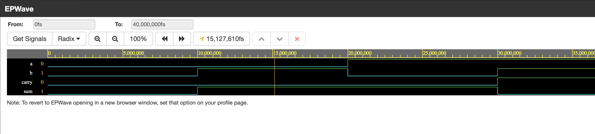
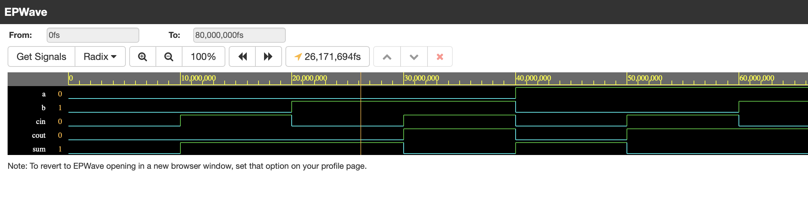
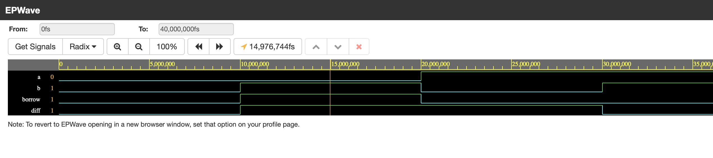
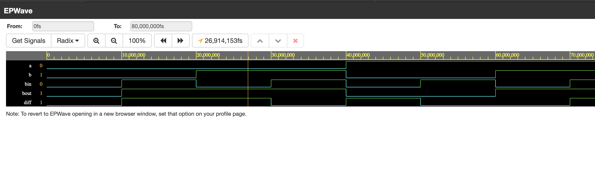

# **Arithmetic Circuits: Adders and Subtractors**

Arithmetic circuits are a crucial part of digital systems and perform basic operations such as addition and subtraction. 

**Half Adder, Full Adder, Half Subtractor, and Full Subtractor** 

## **Table of Contents**
- [Introduction](#introduction)
- [Adders](#adders)
  - [Half Adder](#half-adder)
  - [Full Adder](#full-adder)
- [Subtractors](#subtractors)
  - [Half Subtractor](#half-subtractor)
  - [Full Subtractor](#full-subtractor)

---
## **Introduction**

Arithmetic operations like addition and subtraction are implemented using logic circuits called **adders and subtractors**. These circuits process binary inputs and produce binary outputs, playing a crucial role in digital computing.

---

## **Adders**

### **Half Adder**  [code](https://github.com/bhaarath22/VHDL-Programs/blob/6e4d67fc54d7b492cd394fabb48560b5911e019d/Adder-Subtractor/HalfAdder-BM-if-else.vhdl)
- **Definition**: A half adder adds two **single-bit binary numbers** and produces a sum and a carry output.
- **Boolean Expressions**:
  - Sum (S) = A XOR B
  - Carry (C) = A AND B

| A | B | Sum (S) | Carry (C) |
|---|---|--------|---------|
| 0 | 0 | 0 | 0 |
| 0 | 1 | 1 | 0 |
| 1 | 0 | 1 | 0 |
| 1 | 1 | 0 | 1 |

- **Explanation**: The sum output is derived using XOR, ensuring that when inputs are different, the sum is `1`. The carry is generated only when both inputs are `1`.
### Output

---

### **Full Adder**  [code](https://github.com/bhaarath22/VHDL-Programs/blob/ed952d8fdf8447001dcf31167d41a971e7ae390d/Adder-Subtractor/FullAdder-BM-CASE.vhd)
- **Definition**: A full adder adds **three inputs** (A, B, and Carry-in) and produces a sum and a carry output.
- **Boolean Expressions**:
  - Sum (S) = A XOR B XOR Carry-in
  - Carry (C) = (A AND B) OR (Carry-in AND (A XOR B))

| A | B | C_in | Sum (S) | Carry (C_out) |
|---|---|-----|--------|------------|
| 0 | 0 | 0 | 0 | 0 |
| 0 | 0 | 1 | 1 | 0 |
| 0 | 1 | 0 | 1 | 0 |
| 0 | 1 | 1 | 0 | 1 |
| 1 | 0 | 0 | 1 | 0 |
| 1 | 0 | 1 | 0 | 1 |
| 1 | 1 | 0 | 0 | 1 |
| 1 | 1 | 1 | 1 | 1 |

- **Explanation**: The full adder extends the functionality of the half adder by handling an additional carry input, making it useful for multi-bit addition.
### Output

---

## **Subtractors**

### **Half Subtractor** [code](https://github.com/bhaarath22/VHDL-Programs/blob/6e4d67fc54d7b492cd394fabb48560b5911e019d/Adder-Subtractor/HS-DM-ConditionalSAS.vhd)
- **Definition**: A half subtractor subtracts one **single-bit binary number** from another and produces a difference and a borrow output.
- **Boolean Expressions**:
  - Difference (D) = A XOR B
  - Borrow (B_out) = NOT A AND B

| A | B | Difference (D) | Borrow (B_out) |
|---|---|-------------|--------------|
| 0 | 0 | 0 | 0 |
| 0 | 1 | 1 | 1 |
| 1 | 0 | 1 | 0 |
| 1 | 1 | 0 | 0 |

- **Explanation**: The difference is calculated using XOR, and the borrow is needed when the minuend (A) is smaller than the subtrahend (B).
### Output

---

### **Full Subtractor**  [code](https://github.com/bhaarath22/VHDL-Programs/blob/6e4d67fc54d7b492cd394fabb48560b5911e019d/Adder-Subtractor/FS-DF-SelectedSiganlAssignment.vhdl)
- **Definition**: A full subtractor subtracts **three inputs** (A, B, and Borrow-in) and produces a difference and a borrow output.
- **Boolean Expressions**:
  - Difference (D) = A XOR B XOR Borrow-in
  - Borrow (B_out) = (NOT A AND B) OR (NOT (A XOR B) AND Borrow-in)

| A | B | B_in | Difference (D) | Borrow (B_out) |
|---|---|-----|-------------|--------------|
| 0 | 0 | 0 | 0 | 0 |
| 0 | 0 | 1 | 1 | 1 |
| 0 | 1 | 0 | 1 | 1 |
| 0 | 1 | 1 | 0 | 1 |
| 1 | 0 | 0 | 1 | 0 |
| 1 | 0 | 1 | 0 | 0 |
| 1 | 1 | 0 | 0 | 0 |
| 1 | 1 | 1 | 1 | 1 |

- **Explanation**: The full subtractor extends the half subtractor by handling an additional borrow input, making it useful for multi-bit subtraction.
### Output

---

