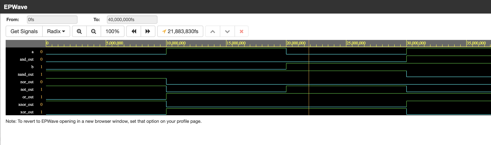

# **Logical Gates**

Logical gates are the basic building blocks of digital circuits. They execute logical operations on a single or multiple binary inputs to deliver a single binary output.

## **Table of Contents**
- [Introduction](#introduction)
- [Basic Logic Gates](#basic-logic-gates)
  - [AND Gate](#and-gate)
  - [OR Gate](#or-gate)
  - [NOT Gate](#not-gate)
- [Universal Gates](#universal-gates)
  - [NAND Gate](#nand-gate)
  - [NOR Gate](#nor-gate)
- [Exclusive Gates](#exclusive-gates)
  - [XOR Gate](#xor-gate)
  - [XNOR Gate](#xnor-gate)

---

## **Introduction**

Logic gates are used to implement Boolean functions in digital electronics. Each gate follows a specific logic rule that determines the output based on the given inputs. The fundamental gates include AND, OR, and NOT, while universal gates (NAND, NOR) can be used to construct any logical function. Exclusive gates (XOR, XNOR) are utilized in specific digital logic applications.

---

## **Basic Logic Gates** [code](https://github.com/bhaarath22/VHDL-Programs/blob/9e4baeb5b740efd41c3048f0d1526f2a4bfb9b7f/DigitalGates/DFM_DG.vhd)

### **AND Gate**
- **Boolean Expression**: \( Y = A AND B)
- **Logic Operation**: Produces HIGH (1) only if all inputs are HIGH (1).

| A | B | Y = A AND B |
|---|---|---|
| 0 | 0 | 0 |
| 0 | 1 | 0 |
| 1 | 0 | 0 |
| 1 | 1 | 1 |

---

### **OR Gate**
- **Boolean Expression**: ( Y = A + B )
- **Logic Operation**: Produces HIGH (1) if at least one input is HIGH (1).

| A | B | Y = A OR B |
|---|---|---|
| 0 | 0 | 0 |
| 0 | 1 | 1 |
| 1 | 0 | 1 |
| 1 | 1 | 1 |

---

### **NOT Gate**
- **Boolean Expression**: ( Y = not A)
- **Logic Operation**: Inverts the input value.

| A | Y = NOT A |
|---|---|
| 0 | 1 |
| 1 | 0 |

---

## **Universal Gates**

### **NAND Gate**
- **Boolean Expression**: ( Y = A NAND B)
- **Logic Operation**: Produces LOW (0) only when all inputs are HIGH (1).

| A | B | Y = NAND |
|---|---|---|
| 0 | 0 | 1 |
| 0 | 1 | 1 |
| 1 | 0 | 1 |
| 1 | 1 | 0 |

---

### **NOR Gate**
- **Boolean Expression**: ( Y = A NOR B)
- **Logic Operation**: Produces HIGH (1) only when all inputs are LOW (0).

| A | B | Y = NOR |
|---|---|---|
| 0 | 0 | 1 |
| 0 | 1 | 0 |
| 1 | 0 | 0 |
| 1 | 1 | 0 |

---

## **Exclusive Gates**

### **XOR Gate**
- **Boolean Expression**: ( Y = A XOR B)
- **Logic Operation**: Produces HIGH (1) when the inputs are different.

| A | B | Y = XOR |
|---|---|---|
| 0 | 0 | 0 |
| 0 | 1 | 1 |
| 1 | 0 | 1 |
| 1 | 1 | 0 |

---

### **XNOR Gate**
- **Boolean Expression**: ( Y = A XNOR B)
- **Logic Operation**: Produces HIGH (1) when the inputs are the same.

| A | B | Y = XNOR |
|---|---|---|
| 0 | 0 | 1 |
| 0 | 1 | 0 |
| 1 | 0 | 0 |
| 1 | 1 | 1 |

---
### **OUTPUT***

