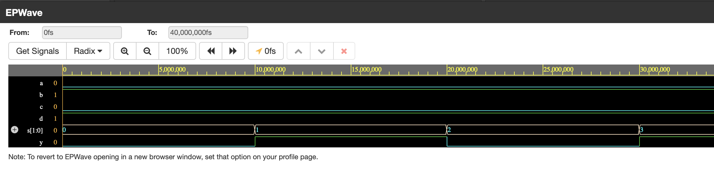
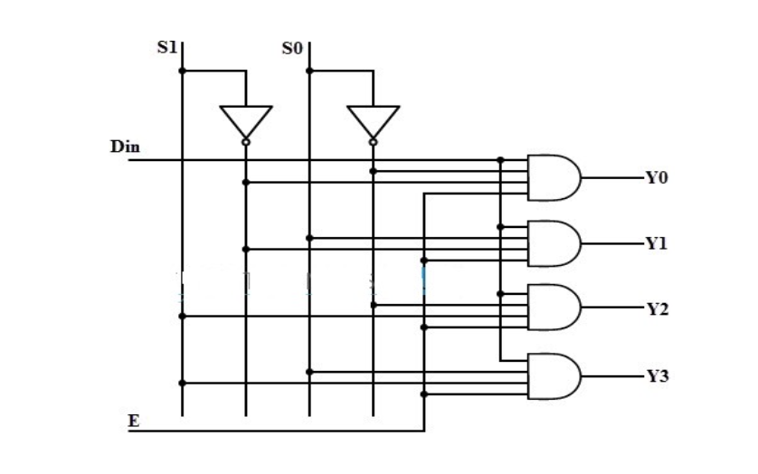
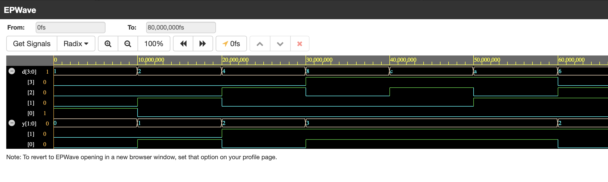
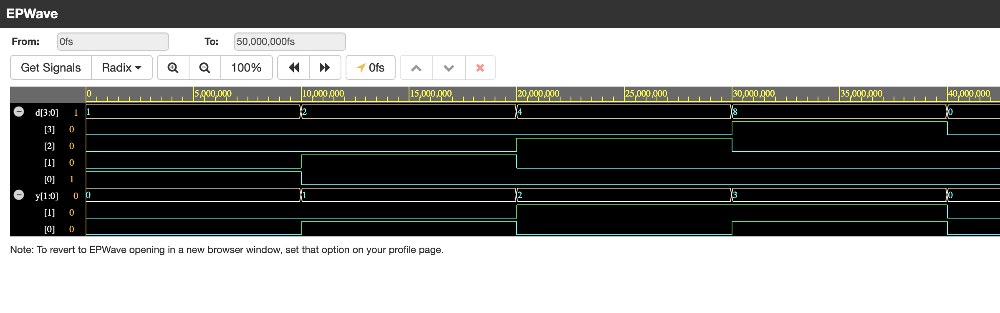
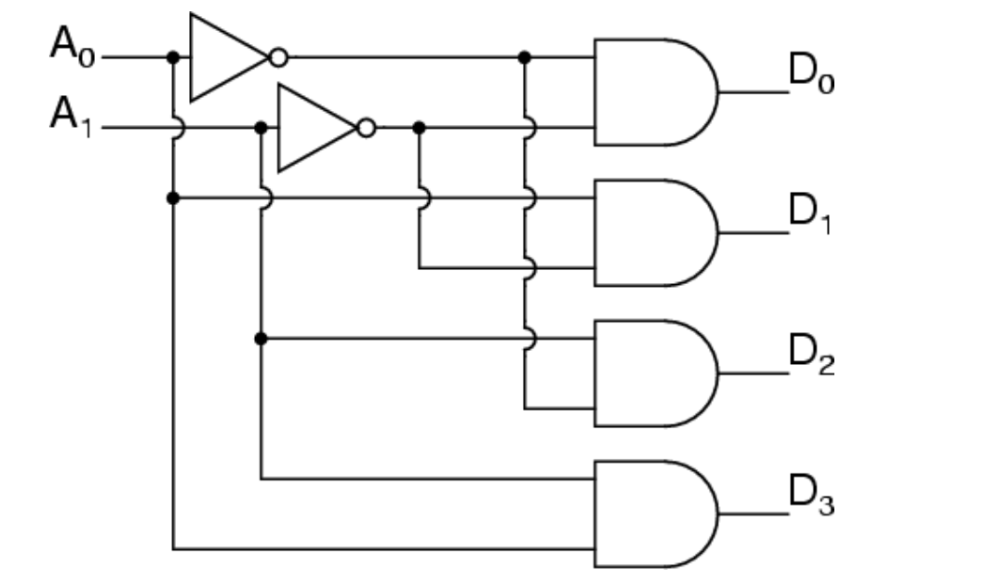
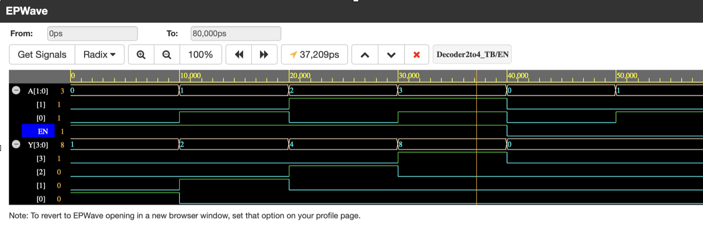

# **Multiplexer Demultiplexer Encoder Decoder**
## **Table of Contents**

- [Multiplexer](#multiplexer)  
- [Demultiplexer](#Demultiplexer)  
- [4-to-2 Encoder](#4-to-2-encoder)  
- [4-to-2 Priority Encoder](#4-to-2-priority-encoder)  
- [2-to-4 Decoder](#2-to-4-decoder)  

## Multiplexer
A multiplexer is a combinational circuit that selects one input from multiple inputs and forwards it to the output based on the selector signals.

### 4-to-1 Multiplexer [code](https://github.com/bhaarath22/VHDL-Programs/blob/222b75be1bf680283fdccba375e69fc26cd3d287/Mux-Demux-Encoder-Decoder/Mux4to1ConditionalSA.vhdl)
A 4-to-1 multiplexer takes four inputs and selects one based on two selector signals.

- **Boolean Expression:**
  
  y = (A AND NOT S1 AND NOT S0) OR (B AND NOT S1 AND S0) OR (C AND S1 AND NOT S0) OR (D AND S1 AND S0)

- **Truth Table:**

| S1 | S0 | y |
|----|----|---|
|  0 |  0 | A |
|  0 |  1 | B |
|  1 |  0 | C |
|  1 |  1 | D |
## output 

---
## Demultiplexer
A demultiplexer is a combinational circuit that takes a single input and distributes it to one of the multiple outputs based on the selector signals.

### 1-to-4 Demultiplexer [code](https://github.com/bhaarath22/VHDL-Programs/blob/222b75be1bf680283fdccba375e69fc26cd3d287/Mux-Demux-Encoder-Decoder/DEMUX-1to4-StructuralModelling.vhdl)
A 1-to-4 demultiplexer takes one input and directs it to one of four outputs based on two selector signals.

- **Boolean Expressions:**
  
  y0 = Input AND NOT S1 AND NOT S0  
  y1 = Input AND NOT S1 AND S0  
  y2 = Input AND S1 AND NOT S0  
  y3 = Input AND S1 AND S0
## circuit

- **Truth Table:**

| S1 | S0 | y0  | y1  | y2  | y3  |
|----|----|-----|-----|-----|-----|
|  0 |  0 | Input | 0  | 0  | 0  |
|  0 |  1 | 0  | Input | 0  | 0  |
|  1 |  0 | 0  | 0  | Input | 0  |
|  1 |  1 | 0  | 0  | 0  | Input |
## Output
  

## 4-to-2 Encoder  [code](https://github.com/bhaarath22/VHDL-Programs/blob/222b75be1bf680283fdccba375e69fc26cd3d287/Mux-Demux-Encoder-Decoder/Encoder4to1-DataFlow.vhdl)
An encoder is a combinational circuit that converts multiple active inputs into a binary code.

A 4-to-2 encoder converts four input lines into a 2-bit binary output.

- **Boolean Expressions:**
  
  y1 = D2 OR D3  
  y0 = D1 OR D3

- **Truth Table:**

| D3 | D2 | D1 | D0 | y1 | y0 |
|----|----|----|----|----|----|
|  0 |  0 |  0 |  1 |  0 |  0 |
|  0 |  0 |  1 |  0 |  0 |  1 |
|  0 |  1 |  0 |  0 |  1 |  0 |
|  1 |  0 |  0 |  0 |  1 |  1 |

## output

---
## 4-to-2 Priority Encoder [code](https://github.com/bhaarath22/VHDL-Programs/blob/222b75be1bf680283fdccba375e69fc26cd3d287/Mux-Demux-Encoder-Decoder/PriorityEncoder4to2-BM-If-else.vhdl)
A priority encoder assigns priority to the highest-order input when multiple inputs are active.

A 4-to-2 priority encoder ensures that the highest-priority input is encoded when multiple inputs are active.

- **Boolean Expressions:**
  
  y1 = D3 OR D2  
  y0 = D3 OR (NOT D2 AND D1)

- **Truth Table:**

| D3 | D2 | D1 | D0 | y1 | y0 |
|----|----|----|----|----|----|
|  0 |  0 |  0 |  1 |  0 |  0 |
|  0 |  0 |  1 |  X |  0 |  1 |
|  0 |  1 | X  |  X |  1 |  0 |
|  1 | X  | X  |  X |  1 |  1 |
## Output

---
## 2-to-4 Decoder [code](https://github.com/bhaarath22/VHDL-Programs/blob/222b75be1bf680283fdccba375e69fc26cd3d287/Mux-Demux-Encoder-Decoder/Decoder2to4-Structural.vhdl)
A decoder is a combinational circuit that converts binary input into a unique active output.

A 2-to-4 decoder takes a 2-bit binary input and activates one of four outputs.

- **Boolean Expressions:**
  
  y0 = NOT A1 AND NOT A0  
  y1 = NOT A1 AND A0  
  y2 = A1 AND NOT A0  
  y3 = A1 AND A0
## circuit

- **Truth Table:**

| A1 | A0 | y0  | y1  | y2  | y3  |
|----|----|-----|-----|-----|-----|
|  0 |  0 |  1  |  0  |  0  |  0  |
|  0 |  1 |  0  |  1  |  0  |  0  |
|  1 |  0 |  0  |  0  |  1  |  0  |
|  1 |  1 |  0  |  0  |  0  |  1  |
## output

These circuits are essential components in digital systems, used for data selection, signal encoding, and binary decoding.

